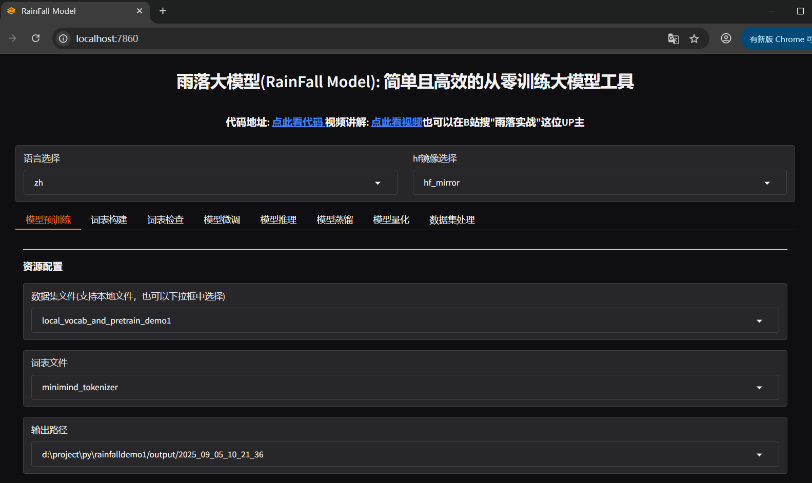
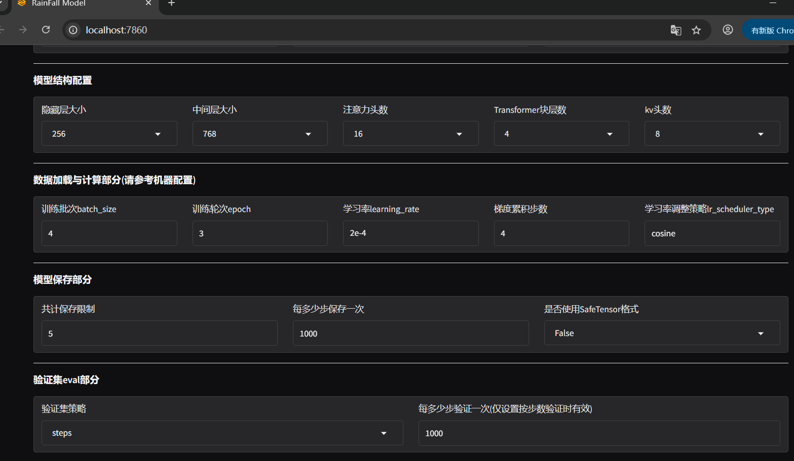

## 雨落大模型工厂RainFallModelFactory
雨落大模型工厂是可以让零基础的新手朋友也可以轻松从零开始训练大模型的工具，它提供了非常友好的UI界面，而且还有非常详细的文档说明和视频教程。

它的主要 **特色** 有:  
1).**新手友好** 。提供界面操作，零基础也可以轻松构建和训练大模型。    
2).**小模型友好**。内置了可以训练4M小模型的默认配置，在4090显卡上10分钟即可训练完成。**模型设计+数据集收集+参数调整**  全都可以在界面上完成。当然也可以通过调整参数实现尺寸更大的模型。  
3). **功能强大** 。涵盖了从词表构建、模型预训练、模型推理、模型微调、模型蒸馏等大模型相关的多个核心流程。

下面是预训练的首页展示:
  

然后是更多的配置信息查看:  
  

## 快速使用教程
雨落大模型工厂的使用方式和LLaMAFactory几乎完全一样，而且在开发过程中也受到了LLaMAFactory的很多启发，借鉴了其设计思路和部分代码实现，这一点在代码的版权信息中有说明。  
具体安装步骤为:  
1.**第一步: 下载源代码。**  可以使用git clone或者直接下载当前代码的zip包(建议下载打了tag的，这样稳定性更好一些)。  
2.**第二步: 在当前目录中执行"pip install -e ."可以进行安装。** 通常可以和LLaMAFactory安装在同一个虚拟环境下，也不排除个别版本不兼容的情况，但是最新稳定版通常是兼容的。  
3.**第三步: 通过在命令行执行"rainfallmodel webui"就可以启动UI界面**，愉快地玩转大模型吧。  
4.第四步: 当然也可以在命令行通过"rainfallmodel help"来查看更多功能，具有非常高的自由度和灵活性。

### 使用文档
1.目前还没有特别完善的使用文档，不过可以在conf目录和data目录下的README.md文件中进行查看，可以完成绝大多数配置和环境准备工作。    
2.可以去我的b站主页https://space.bilibili.com/3493279408588872 找到对应的使用视频说明，可以很方便的使用。  
3.成体系的文档正在准备和编辑中，预计不久将会呈现给大家，有什么问题也可以及时留言。

### 进阶使用
1.可以去B站搜索UP主"雨落实战"，或者直接访问其主页: https://space.bilibili.com/3493279408588872 查看相关视频教程。    
2.有使用上的任何问题都可以在github上留言，或者去我的bilibili主页中私信或留言。  
3.阅读其源代码，建议从src目录下的rainfallmodel下的cli.py看起，会比较容易地理清楚其整体流程。

### 更新记录
持续更新中，欢迎提需求、提建议、提交代码。  
1). 2025年9月发布第一版，并且开源。  
2). 待续。。

